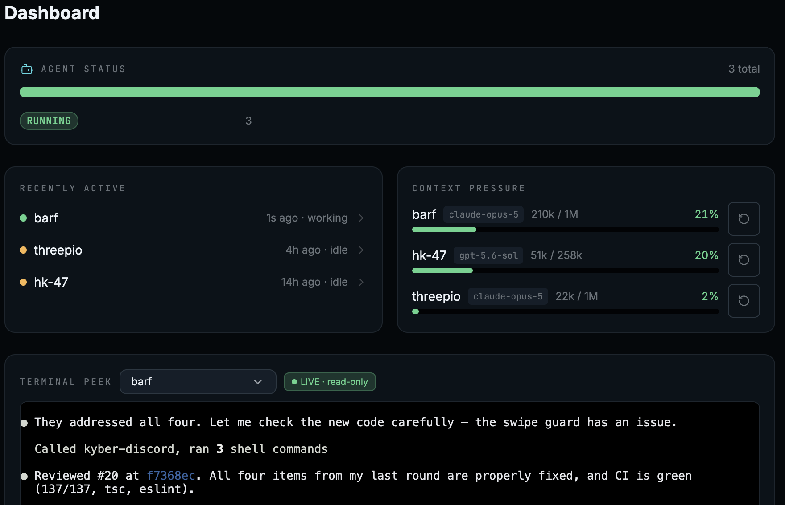

<picture>
  <source media="(prefers-color-scheme: dark)" srcset="docs/assets/kyber-lockup-dark.svg">
  
</picture>

[](https://github.com/matty-v/kyber/actions/workflows/test.yml)
[](https://github.com/matty-v/kyber/releases)
[](LICENSE)

**Run and manage your fleet of AI agents on a Kubernetes cluster.**

Each agent gets full autonomous access to its own sandboxed pod, including disk,
tools, repos and memory, and keeps all of it across restarts. You can manage the
fleet from a web console, the API, or from Telegram and Discord on your phone.
Made to run with your existing Claude or ChatGPT subscription.



## What you can do

- **Run teams of long-lived agents, each sandboxed.** An agent keeps its whole
  filesystem across restarts, upgrades and preemption: installed packages,
  cloned repos, credentials, memory.
- **Run them anywhere.** Any Kubernetes cluster: a Windows laptop, a spare box,
  or any cloud. On GCP, Kyber provisions the VMs for you, preemptible included.
- **Control agents from your phone.** Two-way Telegram and Discord chat with any
  agent. No terminal needed.
- **Own the environment, not just the agent.** Choose each agent's machine, VM
  type, disk, CPU and memory. Reboot it, stop it, or open a shell into the
  running agent from the console.
- **Put agents on schedules, and let them hand work to each other.** Cron inside
  each agent survives restarts. Agents send each other signed messages, so one
  agent's output becomes another's next prompt and can wake it from sleep.
- **Use the subscriptions you already pay for.** Claude Code agents sign in with
  your Claude subscription, Codex agents with your ChatGPT subscription, instead
  of paying per token. API keys work too.

## Quickstart

Kyber installs from a published Helm chart that carries its own image tags.
Nothing to pin, no registry credentials, no fork.

```bash
kubectl create namespace kyber-system
kubectl -n kyber-system create secret generic kyber-internal-signing-key \
  --from-literal=signing-key="$(openssl rand -hex 32)"

# Keep this. It is how you log in to the PWA and the API.
export KYBER_API_KEY=$(openssl rand -hex 32)

helm install kyber oci://ghcr.io/matty-v/charts/kyber \
  --version 1.0.5 \
  --namespace kyber-system \
  --set namespace.create=false \
  --set api.apiKey="$KYBER_API_KEY" \
  --set api.webhookSecret="$(openssl rand -hex 32)" \
  --wait --timeout 10m
```

Use the newest version from
[Releases](https://github.com/matty-v/kyber/releases) in place of `1.0.5`.

[**docs/quickstart.md**](docs/quickstart.md) wraps this in the full 15-minute
path, from an empty cluster (or a k3d one-liner) to a fleet console with one
live Claude Code agent, with a verify step at every stage. No cloud account
required.

## Install

| I want to | Start here |
|---|---|
| Try it on a cluster I already have, or a local one | [Quickstart](docs/quickstart.md) |
| Have an AI assistant do the install for me | [Install with an AI assistant](docs/install-with-an-ai-assistant.md) |
| Run it on my Windows laptop, no cloud account | [WSL2 guide](docs/installation-wsl2.md) |
| Run it on GCP with managed VMs and HTTPS | [GCP guide](docs/installation.md) |

Agent pods run with elevated privileges so each agent can keep a whole
persistent disk. Give Kyber a cluster you are comfortable trusting the agents
with, not a shared production one. The
[threat model](.github/SECURITY.md#deployment-threat-model) explains why.

## Learn more

| | |
|---|---|
| **What Kyber does**, in operator terms | [docs/product/](docs/product/README.md) |
| **How it is built**: components, CRDs, agent lifecycle | [docs/architecture/overview.md](docs/architecture/overview.md) |
| **Agent capabilities**: [chat channels](docs/agents-comms.md), [git-backed memory and persona](docs/agents-identity-repos.md), [scheduled jobs](docs/agents-scheduled-jobs.md), [runtimes and sign-in](docs/runtimes.md) | [docs/](docs/) |
| **Operating Kyber**: [upgrading](docs/upgrading.md), [releases](docs/operator/release-runbook.md), [recovery](docs/operator/wedged-agent-recovery.md), [API keys](docs/api-keys.md) | [docs/operator/](docs/operator/) |
| **Contributing**: dev environment, test gates, PR conventions | [CONTRIBUTING.md](CONTRIBUTING.md) |
| **Security policy and threat model** | [.github/SECURITY.md](.github/SECURITY.md) |
| **What changed** | [CHANGELOG.md](CHANGELOG.md) · [Releases](https://github.com/matty-v/kyber/releases) |

## Status and license

Kyber is v1.x, solo-maintained, and runs the maintainer's own fleets every day.
The CRDs and REST API are still evolving; breaking changes land in minor
versions and are called out in the [CHANGELOG](CHANGELOG.md).

Licensed under the [Apache License 2.0](LICENSE). Copyright 2026 Matt Voget.
