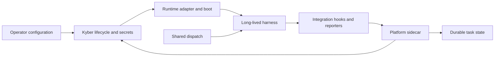

# Kyber Agent Harness Contract — v1 interactive profile

Status: approved contract and implementation; ready for reviewed publication.
Contract version: 1.0. Owner: Kyber maintainers. Tracker: MAT-7.
Read this before adding a runtime or changing its integration boundary.

## 1. Purpose & scope

A **harness** is the upstream execution engine. An **adapter** translates its
behavior into Kyber interfaces. A **runtime** is the registered, packaged
integration deployed for an Agent. MUST/MUST NOT are requirements; SHOULD is
a recommendation requiring an explained exception; MAY denotes optional support.
These are normative target requirements. The evidence matrix explicitly records
which portions are implemented or verified; this contract does not certify either
existing runtime as fully conformant.

V1 supports the existing Linux, persistent, long-lived interactive profile:
shared agent entrypoint, `KYBER_START_CMD`, the platform-managed tmux `agent`
session, and shared prompt delivery. Native commands and config formats belong
to the adapter. Non-tmux transports and one-process-per-task execution require
another approved profile. This is a Kyber contract, not a universal agent SDK.

Required baseline: HC-01 through HC-05 and HC-09. Optional features impose
additional requirements when advertised: HC-06 through HC-08 and HC-10.
Both existing harnesses retain their supported feature/auth combinations.
Platform services do not become optional simply because a harness lacks native
support: the integration must supply the baseline inputs those services require.

## 2. Components & responsibilities

| Owner | Responsibility |
|---|---|
| Shared platform | Agent lifecycle, persistence substrate, identity delivery, authorization, channel transport, durable task state, sidecar forwarding |
| Adapter/integration | Launch/configuration, auth translation, probes, native hooks, transcript/model/usage translation, session commands, repair metadata |
| Operator | Credentials and login consent, configured auth mode, runtime/version selection, explicit public service promises |
| Upstream harness | Model execution and native credential/session mechanisms; provider availability is not guaranteed by Kyber |

The Go `Runtime` groups `Type`, `Adapter`, and reserved `Probe`.
`Probe` is not an implemented general observability interface: in-container
reporters currently feed the sidecar. `Adapter` is only part of the boundary.

| Adapter surface | Requirement/classification |
|---|---|
| Type, Image, EntrypointArgs | HC-01, baseline |
| LivenessProbe, ReadinessProbe, GracefulShutdownSeconds | HC-02, baseline |
| SessionBriefPath, SessionStatePath | HC-03, baseline plumbing; native resume is HC-06 |
| EnvVars, SecretMounts, ModelEnvVar | HC-04/05; explicit model override only when supported |
| CredentialSecretName | HC-05, auth recovery input |
| RestartSessionCommand, CompactSessionCommand | HC-06, optional |
| PreStopCommand | HC-02 implementation hook, MAY be nil when unnecessary |
| RuntimeRepair | HC-10, optional; nil means unavailable |

Production integrations also implement `DescribedRuntime` in
[`descriptor.go`](../../pkg/runtimes/descriptor.go). `Descriptor()` owns the
stable ID, contract/profile version, supported auth modes and optional features,
image key, transcript parser/root, and any explicit legacy catalog/default
projection. `Authentication()` owns credential validation/preparation and
intentional login-pending detection. Optional `DeviceAuthReader` interprets native
login output into a bounded `AuthObservation`; shared code captures the tmux
`auth` pane but does not parse provider-specific text.

`GET /api/v1/config` publishes enabled, image-configured descriptors. Agent
responses contain `runtimeContract` and `runtimeCapabilities` separately from
public service promises. Creation accepts provider-owned `secrets.runtimeAuth`;
existing nonempty credential fields retain precedence for mixed-version clients.
These inputs remain write-only and do not become Agent CRD fields. `/auth`
provides subscription recovery/status; `/oauth` and `/codex-device-auth` remain
compatibility aliases. Existing API-key recovery through credential replacement
is preserved. Switching billing/auth mode still requires recreation.

`POST /internal/agents/{name}/runtime-capabilities` accepts only registered
features from the same runtime and current pod UID. It limits the JSON body to
4 KiB and the feature map to 16 entries; the server stamps observation time.
The reporter submits every 30 seconds; evidence expires after 90 seconds and is
invalidated by pod replacement or an installed-version mismatch. Hook/tool
observations prove native configuration and executable presence, not upstream
execution or provider authentication. Missing, stale or negative evidence cannot
enable dependent task delivery or public task claims. Non-hook session commands
retain their actual in-pod checks in addition to declared capability gates.

Out-of-interface obligations include Docker image/default-version metadata,
start scripts and watchdog behavior, startup prompt/identity loading, managed
MCP configuration, cron and receipt hooks, credential reporters, usage/model
reporters, transcript readers, and release/registration wiring.

## 3. Control / data flow

For subscription login, Claude currently exchanges authorization-code/PKCE
credentials through Kyber; Codex starts a device login in the pod and preserves
opaque auth JSON. API-key mode uses provider-specific Secret references.
A changed Secret may permit a recovery attempt. Codex's `{}` device marker
means human login is pending, not authenticated. Auth mode is not mutable via
the current update request; v1 preserves recreation semantics.

For API-key boot, Codex prepares its native login record with the CLI's stdin
login flow. Claude records approval of the operator-selected key using its
native 20-character key identifier in private state. Claude retains the full
interactive profile so identity, hooks, skills and configured MCP servers load;
`--bare` is not an equivalent integration profile. These native mechanisms
require regression and versioned live checks on harness upgrades.

Credential syncers forward runtime refreshes through the sidecar. **Existing
exception:** Claude boot-time refresh directly calls the control plane using
the self-scoped pod token, which the pod builder mounts. Do not broaden that
access or assert the runtime container has no platform credentials. Migration
of this path is an architectural decision, not accomplished by this document.

## 4. Key invariants & cross-component contracts

| ID | Normative requirement |
|---|---|
| HC-01 | An integration MUST register a stable runtime ID, supply its configured image and launch entrypoint, and report requested/installed upstream versions separately. Missing image or unusable installation MUST fail visibly. Current profile images MUST provide `KYBER_START_CMD` and `KYBER_RUNTIME_DEFAULT_VERSION`. |
| HC-02 | It MUST expose lifecycle observations with their actual meaning and provide a bounded termination budget. Readiness MUST NOT imply authenticated provider availability unless directly evidenced. Startup/auth/install failures MUST remain distinguishable; hard termination MUST NOT imply successful final-state capture. Pre-stop MAY be unnecessary. |
| HC-03 | It MUST use the platform persistence/identity environment, load platform instructions, and provide the continuity inputs it claims to support. Current adapter brief/state paths MUST reside under `/persist`. Native conversation resume MUST be distinguished from platform recall and from durable task recovery. Loss of the persistent volume is outside workspace durability guarantees. |
| HC-04 | It MUST accept prompts through the current shared transport without treating prompt content as shell code; model/configuration overrides it supports MUST be passed explicitly. Session command requests MUST coordinate with dispatch. Optional commands MUST return nil when unsupported, never an empty argv pretending to support an operation. Command delivery success MUST NOT imply operation completion. |
| HC-05 | It MUST declare supported auth modes and preserve the selected mode without implicit billing fallback. Credentials MUST be scoped to that Agent, referenced rather than embedded in pod-spec literals, and excluded from user-visible reports/logs/model context. It MUST define login, refresh ownership, persistence, invalidation and reauthorization behavior, including synchronization failure windows. It MUST distinguish configured credential presence from observed validity and human login pending. The clearer failure classification is a migration requirement where today's implementation conflates failures. |
| HC-06 | If session restart/resume/compaction or scheduled-job controls are offered, the integration MUST implement their actual semantics. Explicit session restart is fresh even when crash resume is enabled. Compaction delivery is asynchronous. Job exclusivity/context clearing require both start and stop hooks and current-boot evidence; stale sentinels MUST NOT enable missing hooks. Job exclusivity is scoped to the job, not a universal execution mutex. |
| HC-07 | Durable task support MUST provide a correlated pre-model acceptance receipt and the platform task-tool completion/control path. Receipt identity includes task, attempt, runtime, session, and optional native turn. Successful tmux delivery MUST NOT imply durable acceptance. A lost POST response MAY be reconciled by exact GET; absent or conflicting evidence MUST fail closed. Ambiguous attempts MUST NOT be blindly redelivered. Neither receipts nor completion guarantee exactly-once external side effects. |
| HC-08 | Cancellation MUST declare `notify_only` versus evidence-backed `exact_interrupt`. Current harnesses provide cooperative notification. Exact interruption requires targeting the receipt's native turn and terminal evidence for that turn. Requesting cancellation MUST NOT be represented as immediate interruption or rollback of prior effects. |
| HC-09 | Each integration MUST distinguish declared support from current availability and unverified/stale evidence. Unsupported operations MUST fail visibly; optional absence MUST NOT prevent unrelated baseline operation. The registered descriptor and bounded observations define the shared vocabulary; availability gates MUST reject missing evidence for dependent features. Observed harness features MUST NOT automatically become MAT-24 public service promises. |
| HC-10 | Claimed tool/channel, model/usage reporting, native resume, or repair features MUST define prerequisites and failure behavior. Model/context unknowns MUST remain unknown. Repair MUST operate within runtime-owned durable paths and distinguish broken installation from missing authorization. A feature MAY remain unsupported with an explicit reason. |

Existing auth values are `oauth` and `api-key`; a new harness need not support
both. Configuring a new auth mechanism/schema requires review, not an arbitrary
string bypass. The implemented descriptor and observation schema above is the v1 machine-readable
boundary. New auth mechanisms require an explicit strategy and client flow; a
new runtime never inherits another provider's credentials, transcripts or defaults.

## 5. Failure modes

| Failure | Required interpretation / current limitation |
|---|---|
| Process present or key exists | Readiness observation, not successful authentication |
| Login pending / rejected | Show pending action or NeedsAuth; a recovery trigger is not proof of success |
| Upstream refresh succeeded, synchronization failed | Retry/surface failure; possible reauthorization, not a lossless guarantee |
| Provider/network outage | MUST be distinct from confirmed invalid credentials; Claude boot currently conflates some exit-2 paths |
| Missing/stale turn-hook sentinel | Dependent job controls unavailable; no silent feature success |
| Receipt unavailable or mismatched | Hook exits 2; task may end delivery_unknown; CLI fail-closed behavior requires live version evidence |
| Cancellation requested | Cooperative control request; no forced interruption claim |
| API-key + Telegram | Current API rejects this combination. Review policy separately; do not infer a provider limitation |
| Hard pod/node death | Persistence and receipt evidence can survive within their storage guarantees; in-flight work may remain uncertain |
| Unknown capability/contract version | Do not advertise availability; preserve unrelated supported features where compatible |

Compatibility rules: contract version, image digest, and installed CLI version
are separate axes. Widening optional vocabulary can be additive; narrowing a
baseline requirement or changing its meaning requires a major contract revision
and migration review. Unknown optional capabilities cannot enable operations.
Retiring an existing supported behavior requires an explicit deprecation,
replacement path, evidence and release note. Discovery and availability gates constrain current operations; the evidence matrix
records which native behaviors have actually been verified.

## 6. Source of truth

Implementation references establish **current behavior**; this normative contract
establishes the approved target. Differences are migration findings, not grounds
to silently weaken the contract or claim the implementation already conforms.

- [`pkg/runtimes/runtime.go`](../../pkg/runtimes/runtime.go) and its adapter subpackages.
- [`pod_builder.go`](../../pkg/controllers/agent/pod_builder.go), runtime start scripts and shared dispatch scripts.
- [`routes_oauth.go`](../../pkg/api/routes_oauth.go), [`routes_codex_auth.go`](../../pkg/api/routes_codex_auth.go), `routes_agents.go`, and `pkg/tokenreport/*credential_sync*`.
- [`cancellation.go`](../../pkg/taskdispatch/cancellation.go), task worker/store and receipt hooks.
- [Evidence and onboarding](agent-harness-conformance.md).

The canonical publication is this repository document. Maintainers review it
alongside integration changes. The approved migration and versioned native auth matrix are recorded in the
conformance guide. Publication follows repository review; the contract version
alone is not a certification of every native feature. Record changes
here by contract version and reference the implementation release. Initial
history: 2026-09-06 — approved v1 scope and test-first migration; 2026-09-07 —
1.0 implementation and four-way native auth evidence ready for publication.

## 7. Cross-references

- [Status pipeline](status-pipeline.md), [lifecycle](agent-lifecycle.md), [durable tasks](durable-tasks.md).
- [Runtime operator guide](../runtimes.md).
- [MAT-7 execution plan](../specs/2026-09-06-mat-7-harness-contract-plan.md).
- [MAT-24 public service manifest](../design/2026-08-30-public-agent-capability-manifest.md).
