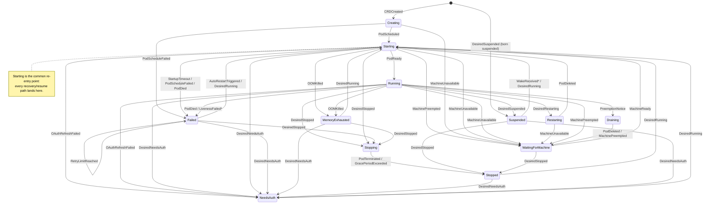

# Agent lifecycle — the controller state machine

> Read this before changing any agent phase, event, or transition — adding a
> phase, rerouting an event, or changing what the reconciler does on a
> transition. The transition table below is authoritative against the code and
> must be kept in sync when `state_machine.go` changes.

## 1. Purpose & scope

An `Agent` custom resource moves through a **pure-function state machine** as
the agent controller observes events (pod scheduled, pod ready, OOM-killed,
preemption notice, operator-requested stop, …). The state machine maps
`(current phase, event) → (action, next phase)`. It has **zero k8s
dependencies** and is fully unit-testable in isolation: it decides *what* to do
and *where to go*; the reconciler is what watches reality, feeds events in, and
executes the returned action.

**Out of scope for this page:** deletion (handled out-of-band — see the
invariant below), the pod build itself, and how the running agent reports
`status.activity` back up (that is the [status pipeline](status-pipeline.md)).

## 2. Components & responsibilities

| Component | File(s) | Responsibility |
|---|---|---|
| Phase enum | [`pkg/api/v1/agent_types.go`](../../pkg/api/v1/agent_types.go) | the set of lifecycle phases (`AgentPhase` constants) + `spec.desiredPhase` / `status.phase` |
| State machine | [`pkg/controllers/agent/state_machine.go`](../../pkg/controllers/agent/state_machine.go) | the `Event` set, the `Action` set, and `NextPhase()` — the pure transition function; also `ShouldResetRetryCount` and `RetryBackoffDuration` |
| Reconciler | [`pkg/controllers/agent/reconciler.go`](../../pkg/controllers/agent/reconciler.go) | watches pods/CRDs, derives events, calls `NextPhase()`, executes the returned `Action`, and handles deletion out-of-band (`handleDeletion`) |
| Status sidecar | [`pkg/controllers/agent/status_sidecar.go`](../../pkg/controllers/agent/status_sidecar.go) | `kyber-status-sidecar` **native sidecar** (`spec.InitContainers` entry with `restartPolicy:Always`, kyber#575) — pushes heartbeats + activity/metrics to the control plane (`AppendStatusSidecar`). Prepended ahead of `session-brief` so the heartbeat is live during boot |
| Transcript tailer | [`pkg/controllers/agent/transcript_tailer.go`](../../pkg/controllers/agent/transcript_tailer.go) | `transcript-tailer` **native sidecar** (`spec.InitContainers`, `restartPolicy:Always`, kyber#575) (kyber#446) — ships the agent's Claude Code session JSONL off the **read-only** PVC on its own stdout for the `?source=transcript` archive lane. A **single-process, poll-based, active-set-bounded reader** (kyber#584): one loop ships only the un-shipped lines of *active* (growing) sessions, one file at a time, so tailer memory is bounded by the **active** session set, **not** the total session-file count — superseding the old per-file `tail -F` follower-process fan-out that OOM-looped aged agents (memory scaled with file COUNT). Reuses the agent runtime image and runs as **root** to read the root-owned JSONL, but non-privileged with no caps + `allowPrivilegeEscalation:false` + `readOnlyRootFilesystem:true` (kyber#451) (`AppendTranscriptTailer`) |
| Session saver | [`pkg/controllers/agent/session_saver.go`](../../pkg/controllers/agent/session_saver.go) | `session-saver` **native sidecar** (`spec.InitContainers`, `restartPolicy:Always`) — maintains the `/persist/session-state.json` recall snapshot (a "last activity" line + the recent turns) by polling the newest session JSONL, so a recreated pod can recall what the prior session was doing. A **separate RW-mounted** container (like the pruner) writing only to the durable persist PVC; same locked-down root posture as the tailer (non-privileged, no caps, `allowPrivilegeEscalation:false`, `readOnlyRootFilesystem:true`). Because native-sidecar teardown runs after the agent container exits, it gets a final poll that captures the last turns of a planned shutdown (`AppendSessionSaver`) |
| Transcript pruner | [`pkg/controllers/agent/transcript_pruner.go`](../../pkg/controllers/agent/transcript_pruner.go) | `transcript-pruner` **native sidecar** (`spec.InitContainers`, `restartPolicy:Always`, kyber#575) (kyber#471) — bounds the on-PVC transcript backlog by removing already-archived session JSONL past the retention policy (default 7d age; optional size ceiling). A **separate RW-mounted** container so the tailer's read-only mount (kyber#446) is untouched and the PVC access mode is unchanged; same locked-down root posture as the tailer (non-privileged, no caps, `allowPrivilegeEscalation:false`, `readOnlyRootFilesystem:true`). Deletes only local already-archived copies — never archive objects. Gated by `transcripts.retention.enabled` (`AppendTranscriptPruner`) |

Every agent pod therefore runs the `agent` runtime as the sole **regular**
container (`Containers[0]`) plus four **native sidecars** (kyber#575) — the
`kyber-status-sidecar`, the `transcript-tailer` (kyber#446), the
`session-saver`, and (when transcript retention is enabled, the default) the
`transcript-pruner` (kyber#471) — and the `session-brief` init/hydration
container, all in `spec.InitContainers`. Agents with a comms channel get one
more **optional** native sidecar per channel: the Discord sidecar (kyber#646)
when `spec.channels.discord` is set, and the Telegram sidecar when Telegram is
enabled (runtime-neutral since kyber#684). The
sidecars carry `restartPolicy:Always`, so the kubelet restarts each on **any**
exit (OOM, panic, SIGTERM, a clean exit 0) **independently of the pod-level
`RestartPolicy:Never`** — before kyber#575 they were regular containers and a
dead sidecar was never restarted, leaving the pod permanently `NotReady` with a
silently-frozen heartbeat until a human pod-deleted it. The pod-level `Never` is
preserved (the #563 agent-container contract): when the agent container exits,
the kubelet tears the native sidecars down in reverse order and the pod reaches a
terminal phase, so the controller's pod-recreate logic fires unchanged. The
sidecars are appended after `BuildPodSpec` (`reconciler.go`); the status-sidecar
is **prepended** to `InitContainers` so its heartbeat is live during the
potentially-slow git-clone boot, while the runtime stays `Containers[0]`.

> **Native-sidecar boot-tolerance invariant (kyber#575).** A native sidecar
> starts *ahead* of the agent container, so anything it needs from the agent's
> runtime may not exist yet at startup — and because it carries
> `restartPolicy:Always`, a startup *exit* is restarted by the kubelet and shows
> as a climbing `restartCount` (a boot crash-loop) rather than the silent
> one-shot death it would have been as a regular container. A native sidecar's
> entrypoint must therefore **wait, not exit**, for any not-yet-present
> dependency. The `transcript-tailer` does this with an explicit boot-wait gate:
> it polls for a transcript projects dir (created by the agent's overlay/bind HOME
> setup) before entering its tail loop, and never exits while waiting — so it
> comes up at `restartCount 0` on a fresh agent. (AC7's live run on kyber-laptop
> caught the tailer crash-looping at boot before this gate was added.)

See
[`log-retention.md`](log-retention.md) for the transcript shipping pipeline and
the PVC-side retention that the pruner enforces.

> **Read-site invariant (kyber#575).** Because the sidecars now live in the Init
> lists, any controller code that looks one up **by name must consult
> `pod.Spec.InitContainers` / `pod.Status.InitContainerStatuses`**, not the
> regular `Containers`/`ContainerStatuses`. Two paths depend on this:
> `extractSidecarSpecImage` (feeds the kyber#299 tag-pinned convergence) and
> `isSidecarReady` (the kyber#371 image-pullability canary). Both scan the Init
> list first and fall back to the regular list so pods built by a pre-#575
> controller still resolve during the rollover. A new read-site that scans only
> the regular lists will **silently** regress (no error, a quietly-disabled
> feature).

`NextPhase(current, event)` returns a `TransitionResult{Action, NextPhase}` (or
an `invalid transition` error if the pair is not in the table — the reconciler
treats an unmapped pair as a no-op-and-requeue rather than forcing a phase).

Codex subscription agents use an in-pod device-login bootstrap. While the
`<agent>-codex-auth` Secret contains the exact `{}` device-auth marker, the
normal two-minute `Starting` timeout is paused so a human can finish
`codex login --device-auth`. Successful login replaces that marker through the
Codex credential syncer; from then on normal startup timeout behavior resumes.
Codex API-key agents do not use this path.

## 3. Phases

The 13 `AgentPhase` constants (`pkg/api/v1/agent_types.go`):

| Phase | Meaning |
|---|---|
| `Creating` | being provisioned (PV, identity repo, pod) |
| `Starting` | pod exists but not yet Ready |
| `Running` | pod Running and readiness probe passes |
| `Stopping` | being gracefully shut down |
| `Stopped` | pod not running, PV preserved |
| `Restarting` | pod being replaced (state captured, new pod starting) |
| `Failed` | exceeded restart retries or hit an unrecoverable error |
| `Suspended` | scaled to zero (pod deleted, PV preserved) — unifies idle-park and spot-preemption-park |
| `Deleted` | fully deleted incl. PV + identity cleanup (reached via `handleDeletion`, **not** the state machine) |
| `Draining` | gracefully draining ahead of a machine preemption |
| `WaitingForMachine` | waiting for a replacement machine after preemption |
| `NeedsAuth` | stored OAuth refresh token is invalid; human must re-authorize |
| `MemoryExhausted` | container was OOM-killed; operator must raise the memory limit before retry |

## 4. Events & actions

**Events** (`Event` constants) — the triggers the reconciler feeds in:

`CRDCreated`, `PodScheduled`, `PodScheduleFailed`, `PodReady`,
`StartupTimeout`, `DesiredStopped`, `DesiredRestarting`, `DesiredSuspended`,
`DesiredNeedsAuth`, `DesiredRunning`, `PodDied`, `LivenessFailed`,
`PodTerminated`, `GracePeriodExceeded`, `PodDeleted`, `AutoRestartTriggered`,
`RetryLimitReached`, `WakeReceived`, `PreemptionNotice`, `MachinePreempted`,
`MachineReady`, `OAuthRefreshFailed`, `OOMKilled`.

`MachineUnavailable` is the provider-neutral capacity-loss event. Active and
retrying Agents park in `WaitingForMachine` without consuming restart retries;
the transition removes any stale pod so `MachineReady` can rebuild it against
the replacement Node.

> **`LivenessFailed` and `WakeReceived` are defined but not yet wired.** Their
> transitions exist in `NextPhase`, but no reconciler or API code currently
> emits either event. `LivenessFailed` carries a `TODO(B3)` — wire it when
> `RestartPolicy` changes or a custom liveness monitor is added. `WakeReceived`
> was designed for message-triggered wake of a `Suspended` agent (e.g. a
> Telegram message), but no production path emits it: inbound webhooks deliver
> only into a running agent's session, and the Telegram sidecar long-polls from
> inside the pod, so a suspended agent resumes only via `DesiredRunning` (an
> operator start). Every other event above is emitted by the reconciler. Both
> transitions are documented below for completeness and marked accordingly.
>
> **kyber#575 note — native sidecars supersede the B3 watchdog for *sidecar*
> self-healing.** The `TODO(B3)` controller-side watchdog (recreate a pod that
> sits `NotReady` past a threshold) was originally the planned recovery for a
> dead sidecar under `RestartPolicy:Never`. With the sidecars promoted to native
> sidecars (`restartPolicy:Always`), the kubelet now self-heals every sidecar
> death mode in-place, so B3 is **not** needed for that case and is **declined**
> here — the only remaining unrecovered death is the agent container itself,
> already covered by the #563 contract (pod-level `Never` → controller recreate).
> The `TODO(B3)` marker is left in place for any future need.

**Actions** (`Action` constants) — what the reconciler executes on a
transition:

`CreatePVAndPod`, `CreatePV`, `WaitForStart`, `LogAndEmitEvent`,
`UpdateStatus`, `KillPodAndEmitEvent`, `SendSIGTERM`,
`CaptureStateAndDeletePod`, `EmitEventAutoRestart`,
`KillPodEmitEventAutoRestart`, `ForceKillPod`, `WriteBriefAndCreatePod`,
`ResetRetryAndCreatePod`, `StayFailedAndAlert`, `DrainAgent`,
`TransitionToWaiting`.

## 5. Lifecycle diagram

`*` `LivenessFailed` and `WakeReceived` are defined but not yet emitted (see § 4).

## 6. Transition table

The complete `NextPhase` mapping — phase × event → (next phase, action). This
is the authoritative table; it mirrors the `transitions` map in
`state_machine.go` one-to-one.

| Current phase | Event | Action | Next phase |
|---|---|---|---|
| *(none)* | `CRDCreated` | `CreatePVAndPod` | `Creating` |
| *(none)* | `DesiredSuspended` | `CreatePV` | `Suspended` |
| `Creating` | `PodScheduled` | `WaitForStart` | `Starting` |
| `Creating` | `PodScheduleFailed` | `LogAndEmitEvent` | `Failed` |
| `Starting` | `PodReady` | `UpdateStatus` | `Running` |
| `Starting` | `StartupTimeout` | `KillPodAndEmitEvent` | `Failed` |
| `Starting` | `PodScheduleFailed` | `LogAndEmitEvent` | `Failed` |
| `Starting` | `PodDied` | `LogAndEmitEvent` | `Failed` |
| `Starting` | `OAuthRefreshFailed` | `UpdateStatus` | `NeedsAuth` |
| `Starting` | `OOMKilled` | `UpdateStatus` | `MemoryExhausted` |
| `Starting` | `MachinePreempted` | `TransitionToWaiting` | `WaitingForMachine` |
| `Creating` | `MachineUnavailable` | `TransitionToWaiting` | `WaitingForMachine` |
| `Starting` | `MachineUnavailable` | `TransitionToWaiting` | `WaitingForMachine` |
| `Running` | `MachineUnavailable` | `TransitionToWaiting` | `WaitingForMachine` |
| `Restarting` | `MachineUnavailable` | `TransitionToWaiting` | `WaitingForMachine` |
| `WaitingForMachine` | `DesiredStopped` | `ForceKillPod` | `Stopped` |
| `Running` | `DesiredStopped` | `SendSIGTERM` | `Stopping` |
| `Running` | `DesiredRestarting` † | `CaptureStateAndDeletePod` | `Restarting` |
| `Running` | `DesiredSuspended` | `CaptureStateAndDeletePod` | `Suspended` |
| `Running` | `PodDied` | `EmitEventAutoRestart` | `Failed` |
| `Running` | `OAuthRefreshFailed` | `UpdateStatus` | `NeedsAuth` |
| `Running` | `OOMKilled` | `UpdateStatus` | `MemoryExhausted` |
| `Running` | `LivenessFailed` *(not yet wired)* | `KillPodEmitEventAutoRestart` | `Failed` |
| `Running` | `PreemptionNotice` | `DrainAgent` | `Draining` |
| `Running` | `MachinePreempted` | `TransitionToWaiting` | `WaitingForMachine` |
| `Stopping` | `PodTerminated` | `UpdateStatus` | `Stopped` |
| `Stopping` | `GracePeriodExceeded` | `ForceKillPod` | `Stopped` |
| `Stopped` | `DesiredRunning` | `WriteBriefAndCreatePod` | `Starting` |
| `Restarting` | `PodDeleted` | `WriteBriefAndCreatePod` | `Starting` |
| `Failed` | `AutoRestartTriggered` | `WriteBriefAndCreatePod` | `Starting` |
| `Failed` | `RetryLimitReached` | `StayFailedAndAlert` | `Failed` |
| `Failed` | `DesiredRunning` | `ResetRetryAndCreatePod` | `Starting` |
| `Suspended` | `WakeReceived` *(not currently reachable — no emitter)* | `WriteBriefAndCreatePod` | `Starting` |
| `Suspended` | `DesiredRunning` | `WriteBriefAndCreatePod` | `Starting` |
| `NeedsAuth` | `DesiredRunning` | `ResetRetryAndCreatePod` | `Starting` |
| `MemoryExhausted` | `DesiredRunning` | `ResetRetryAndCreatePod` | `Starting` |
| `Running` | `DesiredNeedsAuth` | `CaptureStateAndDeletePod` | `NeedsAuth` |
| `Starting` | `DesiredNeedsAuth` | `CaptureStateAndDeletePod` | `NeedsAuth` |
| `Failed` | `DesiredNeedsAuth` | `UpdateStatus` | `NeedsAuth` |
| `MemoryExhausted` | `DesiredNeedsAuth` | `UpdateStatus` | `NeedsAuth` |
| `Stopped` | `DesiredNeedsAuth` | `UpdateStatus` | `NeedsAuth` |
| `Suspended` | `DesiredNeedsAuth` | `UpdateStatus` | `NeedsAuth` |
| `Starting` | `DesiredStopped` | `CaptureStateAndDeletePod` | `Stopping` |
| `Failed` | `DesiredStopped` | `CaptureStateAndDeletePod` | `Stopping` |
| `MemoryExhausted` | `DesiredStopped` | `CaptureStateAndDeletePod` | `Stopping` |
| `Suspended` | `DesiredStopped` | `UpdateStatus` | `Stopped` |
| `Draining` | `PodDeleted` | `TransitionToWaiting` | `WaitingForMachine` |
| `Draining` | `MachinePreempted` | `TransitionToWaiting` | `WaitingForMachine` |
| `WaitingForMachine` | `MachineReady` | `WriteBriefAndCreatePod` | `Starting` |

† `DesiredRestarting` is derived both by the external `spec.desiredPhase=Restarting`
write **and** intrinsically by the reconciler's runtime-image-drift check — see the
`DesiredRestarting` invariant in §7 ([kyber#523](https://github.com/matty-v/kyber/issues/523)).

## 7. Key invariants & cross-component contracts

These are the rules the code enforces; a future change must not break them
silently.

- **The state machine is pure.** `NextPhase` has no side effects and no k8s
  dependencies — all I/O happens in the reconciler from the returned `Action`.
  Keep new logic on this split: decide in `state_machine.go`, act in
  `reconciler.go`.
- **Deletion is out-of-band.** Reaching `Deleted` is **not** a state-machine
  transition. The reconciler's `handleDeletion` runs the finalizer when
  `DeletionTimestamp` is set; deletion can happen from any phase and does not
  go through `NextPhase`. Do not add a `* → Deleted` transition to the table.
- **The finalizer leaves zero orphaned state** ([kyber#565](https://github.com/matty-v/kyber/issues/565)).
  After deleting the pod → PVC → agent-scoped secrets, the finalizer reaps the
  agent's external-store rows so no identity material lingers past deletion: the
  Postgres session brief, and the Redis token-usage snapshot, token + state-change
  accumulators, activity/token time-series (`ts:*`), and wake buffer. The on-PVC
  git clone dies with the PVC; the **remote** GitHub identity repo is deliberately
  **not** deleted (high blast radius — Matt's decision). The non-TTL'd stores
  (brief, both accumulators) are the real orphan risk and *must* be deleted
  explicitly; the TTL'd ones are reaped eagerly anyway so the zero-orphan property
  holds the instant the agent is gone. Each store delete is **idempotent** (a
  finalizer retries), and the cleanup is **fault-tolerant**: a transient
  Postgres/Redis blip requeues, but a *durably* unreachable store does **not**
  wedge deletion forever — after `orphanCleanupMaxAttempts` it completes deletion
  anyway and emits a loud `OrphanCleanupIncomplete` Event naming the unreaped
  stores (so an operator can reconcile by hand). The store handles are threaded
  into `AgentReconciler` from `cmd/control-plane/main.go`; agent deletion now
  depends on Postgres/Redis being reachable to *fully* clean up. See
  [api-authorization.md](api-authorization.md) § Destructive DELETE for the gate
  in front of this.
- **OOM is its own terminal-until-operator phase.** A kernel-OOM-killed
  container routes to `MemoryExhausted` (action `UpdateStatus`, no auto-restart)
  rather than `Failed`-with-auto-restart. Auto-restarting on the same too-small
  memory limit would crash-loop and hide the real problem; the operator must
  raise `spec.resources.memory` and request `DesiredRunning` to recover
  ([kyber#272](https://github.com/matty-v/kyber/issues/272)).
- **OAuth failure requires a human.** `OAuthRefreshFailed` (start-claude.sh
  exit code 2) routes to `NeedsAuth` with no auto-restart; recovery is an
  operator re-authorizing and the resulting `DesiredRunning`.
- **Operator-forced re-auth is gated in the reconciler, and its Action splits
  on live-pod-ness** ([kyber#395](https://github.com/matty-v/kyber/issues/395)).
  `DesiredNeedsAuth` (set by the `force-needs-auth` API action) drops a wedged
  agent to `NeedsAuth`, but only from the recoverable phases (`Running`,
  `Starting`, `Failed`, `MemoryExhausted`, `Stopped`, `Suspended`). The
  allowlist lives in `classifyEvent` — **not** in the API setter, which has no
  allowlist — so that is the security-relevant gate; transient/cleanup phases
  (`Creating`, `Stopping`, `Restarting`, `Draining`, `WaitingForMachine`,
  `NeedsAuth`, `Deleted`) derive no event and are left untouched. The `Action`
  differs by phase: live-pod phases (`Running`, `Starting`) use
  `CaptureStateAndDeletePod` so the wedged pod is actually torn down; pod-less
  phases use `UpdateStatus` (a bare status flip). Recovery is the same exit as
  an auto-`NeedsAuth`: the operator re-authorizes → `DesiredRunning`.
- **`DesiredPhase=Stopped` is an authoritative kill switch — the structural twin
  of operator-forced re-auth** ([kyber#468](https://github.com/matty-v/kyber/issues/468),
  mirroring [#395](https://github.com/matty-v/kyber/issues/395)). A centralized
  `desired == Stopped` allowlist in `classifyEvent`, placed **ahead of the
  per-phase and pod-state switches**, honors Stop from every phase an operator
  can hit it during an incident — `Running`, `Starting`, `Failed`,
  `MemoryExhausted`, `Suspended`. Placing it ahead of the switches is what makes
  it **pre-empt auto-restart**: the `Failed` arm returns `AutoRestartTriggered`
  before any later check, so a crash-looping agent (which never sits in
  `Running`) would otherwise ignore Stop entirely — the
  [#466](https://github.com/matty-v/kyber/issues/466) incident behavior.
  Because the block also returns before the pod-state switch, **Stop wins over a
  same-reconcile `PodDied`/`OOMKilled`** — deterministic precedence by ordering,
  not a tiebreak. The `Action` splits on live-pod-ness like #395: live/terminal-pod
  phases (`Starting`, `Failed`, `MemoryExhausted`) route through `Stopping` via
  `CaptureStateAndDeletePod` (idempotent on a nil/terminal pod) so the pod is
  provably gone; pod-less `Suspended` flips status straight to `Stopped`; `Running`
  keeps its graceful `SendSIGTERM`. The allowlist **excludes `Stopped`** (unlike
  the #395 allowlist): once `Phase==Stopped` with `desired==Stopped`, `classifyEvent`
  derives no event, so the agent is a **stable fixed point that stays down across
  resyncs** until `desired` flips to `Running`. As with #395 the allowlist is the
  security-relevant gate — the API setter `setAgentDesiredPhase` has none — and
  broadening honored phases is fail-safe (a forged/stale `Stopped` only halts an
  agent; it cannot keep one up or run stale state).
- **`DesiredRestarting` has an intrinsic trigger, not only the external
  `spec.desiredPhase` write** ([kyber#523](https://github.com/matty-v/kyber/issues/523)).
  The `Running → Restarting` row above is driven by `DesiredRestarting` from two
  sources: the operator/API path (`spec.desiredPhase=Restarting`, e.g.
  `rollAgentForUserSecret`, which nudges the next reconcile from *outside* the
  loop), **and** a reconciler-internal **runtime-image-drift** check. In
  `classifyEvent`'s `case Running` — after the desired-phase checks, so operator
  intent keeps precedence — the reconciler compares the live pod's agent-container
  spec image against the controller's currently-desired image
  (`resolveAdapter(agent).Image()`) and returns `EventDesiredRestarting` directly
  (no `spec` round-trip) when they differ. This rolls a live agent onto a new
  runtime image (e.g. a razer `sync-razer-latest.yml` digest bump or a falcon
  gated release) with its work preserved. It is **`Running`-only** by construction
  (physically inside `case Running`; dormant/transient phases pick up the new image
  on next start via `BuildPodSpec`) and **converges in one roll**: the recreated
  pod's image is set from the same `adapter.Image()`, so the next reconcile compares
  equal and derives no event. The comparison is **full-ref** (`repo:tag@digest`)
  and **spec-to-spec** — a digest-only change on a pinned `:latest` is detected,
  and kubelet `ImageID` normalization noise is avoided. Fail-safe: an empty desired
  image or a `resolveAdapter` error skips the check (never roll a `Running` agent
  over an image-resolution hiccup — [kyber#360](https://github.com/matty-v/kyber/issues/360)
  Cause D). This is the direct sibling of the status-sidecar spec-image drift
  detector (`isSidecarSpecMismatched`); the runtime-image helper is
  `isAgentRuntimeImageDrifted`.
- **The runtime-image-drift roll is canary-gated and concurrency-capped**
  ([kyber#529](https://github.com/matty-v/kyber/issues/529)). The drift
  *detection* above is unchanged; what changed is the rollout *pacing*. Because
  `KYBER_AGENT_RUNTIME_IMAGE` is fleet-wide, every `Running` agent in an env
  derives the drift event in the same controller sweep — so the bare #523 roll
  would roll the whole fleet at once and a bad/unpullable digest would fleet-wide
  into `ImagePullBackOff`. The `isAgentRuntimeImageDrifted` check is now fronted by
  `shouldRollRuntimeImage`, which only returns `EventDesiredRestarting` when drift
  is real **and** two gates allow this agent to be next:
  - **Shared cluster-wide delete budget.** At most
    `runtimeImageRollDefaultMaxConcurrent` (=1) agent-pod deletes in flight,
    measured by the **path-agnostic** `countAgentPodsBeingDeleted` — the *same*
    counter the sidecar auto-roll and status/Telegram/Discord convergence paths
    use, so every automatic rollout cause shares **one** budget. Persisted
    `desiredPhase=Restarting` reservations count before a pod begins terminating.
  - **Observed-evidence canary** (the [kyber#371](https://github.com/matty-v/kyber/issues/371)
    FSM, now the image-agnostic `imageCanaryTracker` instantiated as both
    `sidecarCanary` and `runtimeCanary`). The first eligible agent is the canary
    and rolls; the rest are **held** until a pod is observed `Ready` on the new
    image (verification trigger at the top of `Reconcile`, via `isAgentReady`),
    which marks the image verified and releases the steady-state wave. If the
    canary window (`runtimeCanaryWindow`, default `runtimeImageCanaryDefaultWindow`)
    elapses without a `Ready` pod the image is marked **failed** and further rolls
    are held with a `RuntimeImageRollHeld` Event — so a bad digest is contained to
    the canary, not the fleet.

  There is deliberately **no idle gate** (unlike `convergeSidecarImage`): a
  single-agent env (razer / r2-d2) must keep #523/#527's immediate roll-and-
  converge behavior, and the lone agent is always its own canary, so it rolls
  without waiting. Any knob (`RuntimeImageCanaryWindow`) is **additive** — unset =
  the documented default = current behavior; it is package-default-only (not
  chart-wired), mirroring `SidecarImageCanaryWindow`. Runtime and sidecar paths
  arm their canary at the gate decision, persist `desiredPhase=Restarting`, and
  let the state machine delete through `CaptureStateAndDeletePod`. Only Running
  Agents may reserve this restart, and a canary is armed only after the request
  succeeds. Persisting intent first prevents a concurrent reconcile from
  classifying Kyber's own rollout deletion as `PodDied` without leaving sticky
  restart intent or phantom canaries in parked phases.
- **Lifecycle mutations are caller-scope-gated at the API (kyber#474).** The
  `classifyEvent` allowlist above bounds the *effect* of a `desiredPhase`; the
  complementary *caller* gate lives at the `setAgentDesiredPhase` chokepoint:
  `start`/`stop`/`restart` require `lifecycle:write`, the impactful `suspend` /
  `force-needs-auth` require the strictly-higher `lifecycle:admin` (admin ⊃
  write), so the impactful verbs are never less-protected than fail-safe Stop.
  Off by default (permissive/audit), legacy key = full scope. See
  [api-authorization.md](api-authorization.md).
- **`Suspended` unifies preemption-park and idle-park.** Both a spot-preemption
  outcome and an idle "no work right now" land an agent in `Suspended`; an
  operator `DesiredRunning` brings it back through `Starting`. (`WakeReceived`
  is defined for message-triggered wake but is not yet emitted by any production
  path — see § 4; an inbound message cannot wake a suspended agent today.)
- **`Starting` is the single recovery re-entry point.** Every resume/restart
  path (`Stopped`, `Restarting`, `Failed`, `Suspended`, `NeedsAuth`,
  `MemoryExhausted`, `WaitingForMachine`) re-enters at `Starting`, never
  directly at `Running` — readiness is always re-proven.
- **Retries are bounded with backoff.** `Failed → Failed` on
  `RetryLimitReached` parks-and-alerts rather than looping. `RetryBackoffDuration`
  is exponential (10s, 30s, 90s, ×3) and `ShouldResetRetryCount` clears the
  counter only after the agent has been `Running` for ≥ 5 minutes.
- **Identity-repo git is App-scoped and fail-loud — no PAT fallback**
  ([kyber#508](https://github.com/matty-v/kyber/issues/508) Stage 3/4, superseding
  the #509 PAT-only cutover). Every agent that has an identity repo
  (`spec.identityRepo.repo`) authenticates **reads and writes of that one repo**
  with a short-lived token minted by the install's **Kyber Platform GitHub App**,
  never with the generic PAT. The flow, wired at pod boot by `start-claude.sh` and
  served by `pkg/api/internal.go`:
  1. `start-claude.sh` writes a git credential helper
     (`~/.local/bin/git-credential-kyber-github`) and enables
     `credential.useHttpPath` so git tells the helper *which* repo it is
     authenticating (without it the helper can't tell the identity repo from any
     other and would wrongly emit the PAT — this config is load-bearing).
  2. For a git op **against the agent's own identity repo**, the helper
     `GET`s `/internal/agents/{name}/identity-repo-token` on the control-plane
     internal API (`:8082`), authenticating with the pod-token at
     `/var/run/secrets/kyber/pod-token`. `handleIdentityRepoToken` resolves the
     agent's repo slug from its CR, calls `githubapp.Client.MintScopedToken` for
     `{repositories:[<repo>], permissions:{contents:write}}`, and returns a
     `~1h` token. The helper caches it (mode 600, reused until ~120s before
     expiry) and never writes it into `~/.gitconfig`.
  3. For **any other repo** (a maintainer agent's cross-repo work) the helper
     emits the generic PAT (`$GH_TOKEN` / `$USER_GITHUB_TOKEN`).
  - **No PAT fallback for the identity repo.** If the App flow fails — endpoint
    `503` (App unconfigured: no `identityRepoTokenMinter` wired), pod-token
    unreadable, mint error, empty response — the helper emits **nothing** so git
    **fails loudly**. A broken identity-repo credential path must surface, not be
    silently masked by the broad PAT. This is why the endpoint returning `503` on
    an unconfigured install does **not** mean "use the PAT instead" for the
    identity repo.
  - **Same-agent guard.** The endpoint sits behind the same per-agent pod-token
    boundary as the rest of `:8082` — `authorizeAgentSelf` admits the call only
    when the token identity equals `{name}`, so an agent can only ever mint its
    own repo's token (cross-agent → 403). See
    [`internal-api-auth.md`](internal-api-auth.md) (kyber#566) for that boundary;
    the `identity-repo-token` route is one of its consumers.
  - **Configured per-install, disables cleanly.** The GitHub App is a plugin an
    install enables via the `kyber-github-app` Secret + `identityRepo.defaultOwner`
    (chart default empty). Unconfigured → `WithIdentityRepoTokenMinter` is not
    wired, the endpoint `503`s, and agents run without an identity repo; the
    identity repo is never backfilled with a PAT. Full credential model:
    [`../agents-identity-repos.md`](../agents-identity-repos.md).

## 8. Failure modes

| Failure | Detected by (event) | Resulting phase / response |
|---|---|---|
| Scheduler can't place the pod | `PodScheduleFailed` | `Failed` (log + event) |
| Pod never becomes Ready in 120s | `StartupTimeout` | `Failed` (kill pod + event) |
| Pod dies unexpectedly while Running | `PodDied` | `Failed` → auto-restart (under retry limit) |
| Agent container OOM-killed | `OOMKilled` | `MemoryExhausted` (no auto-restart) |
| Native **sidecar** OOM-killed / flapping (transcript-tailer, kyber-status-sidecar) | reconciler pod-status scan `sidecarOOMOrFlapping` (kyber#584 Phase C) | best-effort **`SidecarOOMRestart` warning alert** via the existing path → `WebhookAlertSink` → Echo Base / Telegram, deduped per escalation. The sidecar still self-heals under `restartPolicy:Always` (kyber#575) — this surfaces it so a memory regression can't hide behind the auto-restart (closes the #575 masking that hid #584). Threshold: restartCount ≥ 3 or an OOMKilled (current or last) termination. Does **not** change agent phase. **Delivery** (kyber#586): the alert is pushed to a receiver only when `KYBER_ALERT_WEBHOOK_URL` is configured; otherwise it is log-only and the control plane warns loudly at startup. The receiver contract (payload/transport/auth) is in `docs/operator/telemetry.md` |
| OAuth refresh fails (exit 2) | `OAuthRefreshFailed` | `NeedsAuth` (no auto-restart) |
| Spot machine preempted (with notice) | `PreemptionNotice` → drain → `PodDeleted` | `Draining` → `WaitingForMachine` |
| Spot machine preempted (no notice) | `MachinePreempted` | `WaitingForMachine` |
| Retry budget exhausted | `RetryLimitReached` | stays `Failed`, alerts operator |
| Bad/unpullable fleet-wide runtime-image bump | canary roll → pod never `Ready` → `RuntimeImageRollHeld` Event after the canary window (kyber#529) | only the canary lands in `ImagePullBackOff`; the rest of the fleet stays `Running` on the old image |

## 9. Source of truth

The doc tracks the code; on any conflict, the code wins and this page is stale.

- [`pkg/controllers/agent/state_machine.go`](../../pkg/controllers/agent/state_machine.go)
  — `Event`, `Action`, `NextPhase`, retry helpers (authoritative for events,
  actions, and every transition in § 6).
- [`pkg/api/v1/agent_types.go`](../../pkg/api/v1/agent_types.go) — the
  `AgentPhase` constants (authoritative for § 3).
- [`pkg/controllers/agent/reconciler.go`](../../pkg/controllers/agent/reconciler.go)
  — which events the reconciler actually emits, and `handleDeletion`.
- Identity-repo credential flow (§ 7 invariant):
  [`images/claude-code/start-claude.sh`](../../images/claude-code/start-claude.sh)
  (credential helper + boot clone),
  [`pkg/api/internal.go`](../../pkg/api/internal.go) (`handleIdentityRepoToken`),
  [`pkg/githubapp/client.go`](../../pkg/githubapp/client.go) (`MintScopedToken`),
  and `cmd/control-plane/main.go` (`WithIdentityRepoTokenMinter` wiring).

## 10. Cross-references

- Overview hub: [`overview.md`](overview.md) § 5 (agent / session lifecycle).
- Sibling deep-dive: [`status-pipeline.md`](status-pipeline.md) — how a running
  agent's activity flows back to the control plane.
- Product / WHAT mirror: `docs/product/` ([kyber#397](https://github.com/matty-v/kyber/issues/397)).
- Related: [`../adr/`](../adr/) — architecture decision records.
