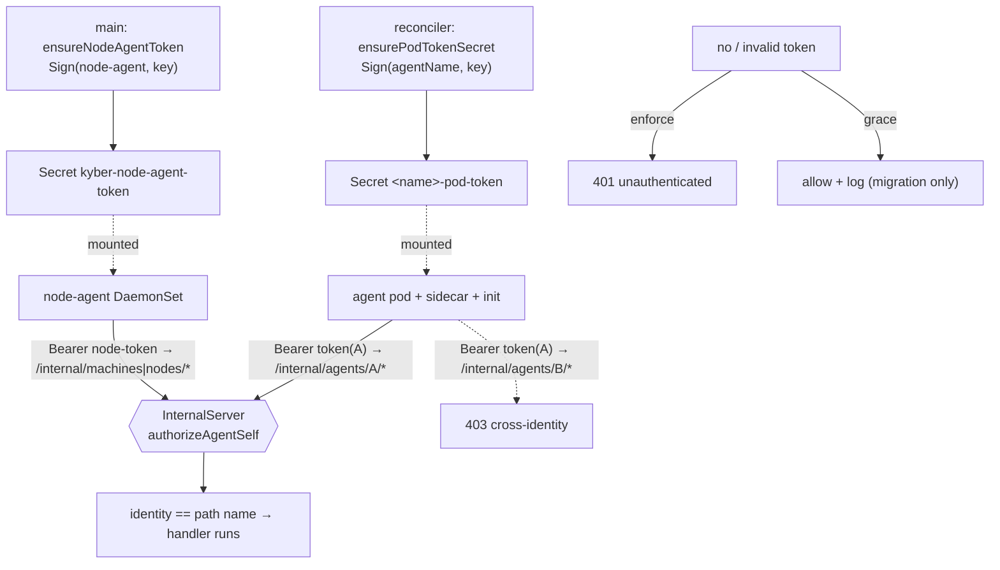

# Internal-API authentication — per-agent identity on :8082 (kyber#566)

> How Kyber authenticates and authorizes callers of the cluster-internal API
> (`:8082`) so an agent can act only on **itself**. Read this before changing
> `pkg/api/internal.go`, `pkg/api/internal_auth.go`, `pkg/podtoken`, the pod-token
> mint/mount path (`pkg/controllers/agent/reconciler.go`, `pod_builder.go`), or
> the internal-API NetworkPolicy. Sibling of
> [`api-authorization.md`](api-authorization.md) (the *public* API, #474).

## 1. Purpose & scope

The internal API (`pkg/api/internal.go`, `:8082`) is the control-plane surface
that agent pods, their sidecars/init containers, and the node-agent call to fetch
session briefs, rotate OAuth tokens, report telemetry, and mint a short-lived
token scoped to the agent's own identity repo
(`GET /internal/agents/{name}/identity-repo-token`, kyber#508 Stage 3/4 — a
consumer of exactly the `authorizeAgentSelf` boundary this page documents; see
[`agent-lifecycle.md`](agent-lifecycle.md) § 7). It used to be
**unauthenticated by design** — it trusted the cluster-internal network. That
trust was unfounded: every agent pod runs `privileged` and can dial the
control-plane Service on `:8082`, and every `/internal/agents/{name}/…` handler
trusted the `{name}` in the path with no proof the caller *was* that agent. So
any agent could overwrite **another agent's** OAuth Secret
(`POST /internal/agents/{name}/refresh-token`), read another agent's session
brief, or spoof another agent's telemetry. This was the headline **C1**
cross-agent isolation gap from the Fable 5 audit ([#559](https://github.com/matty-v/kyber/issues/559)).

This page documents the two controls that close it. **In scope:** the pod-token
identity mechanism, the per-identity authz boundary, the enforcement/grace
rollout posture, and the NetworkPolicy posture. **Out of scope:** the public API
authz model (`api-authorization.md`, #474 — a separate caller/scope vocabulary);
the agent sandbox boundary itself (kyber#78 and
[ADR 0003](../adr/0003-agent-sandbox-isolation.md) — this page contains the
blast radius, it is not what closes the breakout path).

## 2. Components & responsibilities

| Component | File(s) | Responsibility |
|---|---|---|
| Token primitive | `pkg/podtoken/podtoken.go` | `Sign(identity,key)` / `Parse(token,key)` — HMAC-SHA256 over the identity. Leaf package (see § 4 on the import cycle). |
| Verifier + authz | `pkg/api/internal_auth.go` | `HMACInternalAuthenticator` resolves the Bearer token → identity; `authorizeAgentSelf` / `authorizeNodeAgent` enforce act-on-self-only; `WithInternalAuth(authn, graceMode)`; `WithInternalAuthFailClosed()` (503 every route when the key is missing). |
| Enforcement points | `pkg/api/internal.go`, `internal_nodes.go` | The three `/internal/*` dispatchers call the authz helper before any handler runs. |
| Per-agent mint | `pkg/controllers/agent/reconciler.go` (`ensurePodTokenSecret`) | Mints the `<name>-pod-token` Secret (labeled `kyber.io/agent`, owner-ref'd, finalizer-cleaned). |
| Node-agent mint | `cmd/control-plane/main.go` (`ensureNodeAgentToken`) | Mints the singleton `kyber-node-agent-token` Secret at startup. |
| Mount | `pkg/controllers/agent/pod_builder.go`, `status_sidecar.go`, node-agent DaemonSet | Mounts the token at `/var/run/secrets/kyber/pod-token` (Optional). |
| Clients | `start-claude.sh`, `kyber-job-dispatch`, `cmd/status-sidecar`, `pkg/nodeagent` | Read the token file and send it as `Authorization: Bearer`. |
| NetworkPolicy | `deploy/helm/kyber/templates/networkpolicy.yaml` | `:8082`-scoped attack-surface reduction (second layer). |

## 3. Control / data flow

The signing key never leaves the control plane. The token is minted once per
(identity, key) and is stateless — verification is one HMAC compare, no
Kubernetes round-trip on the hot path.

## 4. Key invariants & cross-component contracts

- **An agent acts only on itself.** `authorizeAgentSelf` admits an
  `/internal/agents/{name}/*` request only when the verified token identity
  equals `{name}`. Enforced in the dispatcher *before* any handler, so it cannot
  be bypassed by reaching a route directly. This is the load-bearing control.
- **Machine/node routes are node-agent-only.** `authorizeNodeAgent` admits only
  the reserved `podtoken.NodeAgentIdentity`; an agent token is 403 there (so an
  agent cannot spoof node/preemption telemetry).
- **401 vs 403 are distinct and meaningful.** No/invalid token → 401
  (unauthenticated); valid token, wrong identity → 403 (forbidden). Grace mode
  softens **only** the 401 case.
- **Grace mode never softens a cross-identity denial.** A valid token only exists
  *after* a pod has re-rolled onto a mounted token, so a cross-identity attempt is
  never a migration straggler — it is always 403, even in grace mode. (This is why
  the rollout is safe: grace covers not-yet-rolled pods without opening a
  cross-agent window.)
- **The signing key is the single source of identity.** The reconciler (per-agent),
  the control-plane startup (node-agent), and the verifier all derive from the one
  `KYBER_INTERNAL_SIGNING_KEY`. Rotating it re-signs every token on the next
  reconcile / restart (idempotent, rotation-safe).
- **The token primitive is a leaf package.** `pkg/api` already imports
  `pkg/controllers/agent`, and the reconciler must *sign*, so the shared
  sign/verify primitive cannot live in `pkg/api` without an import cycle — hence
  `pkg/podtoken`. The HTTP-layer authenticator stays in `pkg/api/internal_auth.go`.
- **The internal-API NetworkPolicy cannot authorize agent identities.** Every agent pod must be
  allowed to reach `:8082` (its own sidecar/init call it), so the NP is strictly a
  second layer; the authz above is what isolates agents.

## 5. Failure modes

| Failure | Detected by | System response |
|---|---|---|
| Signing key absent (`KYBER_INTERNAL_SIGNING_KEY` empty) | startup log + per-request `503` | **Fail-CLOSED (Matt's call):** `WithInternalAuthFailClosed` makes every `:8082` route `503` rather than serve unauthenticated — a missing-key deploy cannot silently re-open the cross-agent hole. Scoped to `:8082` (other control-plane surfaces keep running; no crashloop). The listener still starts so callers get a clean `503`. |
| Pod not yet re-rolled (no token mounted) | 401 path | Grace mode (one release) accepts-and-logs; enforce mode 401s. The Optional mount + grace are what make the staged roll safe. |
| Cross-agent / cross-identity call | authz check | 403, audit-logged (`caller`, `want`, `route`) — never the token value. |
| CNI does not enforce NetworkPolicy | delivery-time empirical check (Ackbar) | The NP silently no-ops; **authz still holds**. Verified per target, not assumed. |
| node-agent (hostNetwork) dropped by NP | delivery-time | Its traffic comes from the node IP (unselectable by podSelector); admit it via `networkPolicy.internalApi.allowedNodeCIDRs`. Empty + enforcing CNI ⇒ node-agent `:8082` calls dropped (agent auth unaffected). |

## 6. Source of truth

The authoritative code: `pkg/podtoken/podtoken.go` (token format),
`pkg/api/internal_auth.go` (verify + authz), `pkg/api/internal.go` /
`pkg/api/internal_nodes.go` (enforcement points),
`pkg/controllers/agent/reconciler.go` (`ensurePodTokenSecret`),
`cmd/control-plane/main.go` (`ensureNodeAgentToken`, wiring),
`deploy/helm/kyber/templates/networkpolicy.yaml` + `values.yaml` (`internalAuth`,
`networkPolicy`). This page tracks them; on a conflict, the code wins — update
this page in the same change.

## 7. Rollout (operator) — GRACE-FIRST cutover (kyber#578)

After the v2.1.0 incident (enforce shipped, the signing-key Secret was never
delivered → the whole internal API 503'd silently for ~2h → fleet outage), the
cutover is hardened with **defense in depth**. A *new* internal-auth rollout
defaults to **grace** (`internalAuth.graceMode: true`); enforce is an explicit,
key-verified flip. The full operator procedure + alert response is in
[`../operator/internal-api-auth-rollout.md`](../operator/internal-api-auth-rollout.md);
the model:

- **L1 — grace-first + conservative fail-closed.** The chart defaults a fresh
  rollout to grace (back-compat: an explicit `graceMode` pin is unchanged). A
  missing key **fails closed regardless of grace** (Matt's Q1=NO — never serves
  unauthenticated); the `decideInternalAuthBoot` startup decision
  (`cmd/control-plane/internal_auth_boot.go`) is the single source of that posture.
- **L2 — key-presence deploy gate.** `scripts/preflight-internal-auth-key.sh`
  aborts a keyless **enforce** cutover before it reaches a cluster (grace
  warns-but-proceeds), and the `--post-apply` check asserts the control plane
  logged `internal API per-agent auth enabled`.
- **L3 — fail-closed startup alert.** A keyless startup fires one alert via the
  `alertSink` (`InternalAuthFailClosed` critical / `InternalAuthGraceNoKey`
  warning) naming the Secret + impact — a startup/state alert, not per-request, so
  it cannot flood. Delivery to Telegram/Echo Base depends on
  `KYBER_ALERT_WEBHOOK_URL` ([#586](https://github.com/matty-v/kyber/issues/586)).

**Keyless behavior matrix** (bold = the conservative posture this issue locks):

| graceMode | key present | behavior |
|---|---|---|
| enforce (false) | yes | full enforcement (steady state) |
| grace (true) | yes | mint/verify; accept unauthenticated stragglers (logged); **block cross-identity 403 always** |
| grace (true) | **no** | **fail-closed 503 + `InternalAuthGraceNoKey` warning alert** (no unauthenticated window) |
| enforce (false) | **no** | **fail-closed 503 + `InternalAuthFailClosed` critical alert** |

Sequence, owned by Ackbar:

1. Deliver the `kyber-internal-signing-key` Secret (out-of-band; never committed).
2. Release N — `graceMode: true`: let the controller re-roll every agent pod onto
   its token; confirm the post-apply check passes.
3. Release N+1 — flip `graceMode: false` (enforce), an explicit key-verified step
   gated by the L2 preflight + Ackbar's deploy-review checklist.
4. Enable + verify the NetworkPolicy **per target**: confirm the CNI enforces it
   (k3s NP controller present / GKE Dataplane V2 or Calico), and set
   `allowedNodeCIDRs` for the hostNetwork node-agent.

Cross-refs: consumes/extends the scoped-key taxonomy
([#474](https://github.com/matty-v/kyber/issues/474), `api-authorization.md`);
closes the C1 isolation gap of the Fable 5 audit
([#559](https://github.com/matty-v/kyber/issues/559)).
