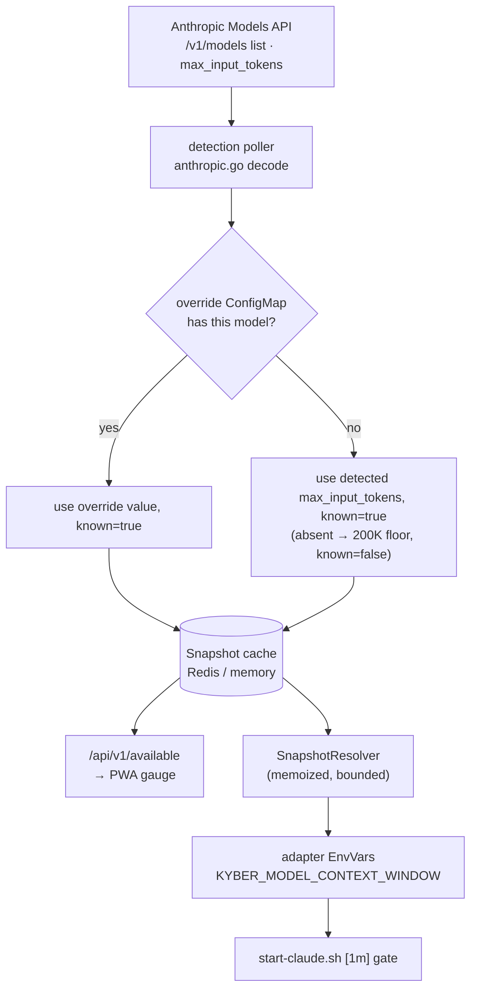
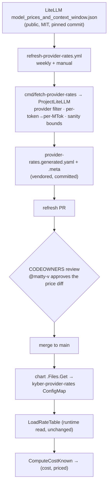

# Data-driven model onboarding — auto-detected windows + feed-derived pricing

> Read this before changing how kyber discovers a model's **context window** or
> its **pricing**, or before touching the LiteLLM pricing feed. It is the
> architecture home for the model-onboarding epic ([kyber#489](https://github.com/matty-v/kyber/issues/489)):
> how a newly-released Claude model becomes fully usable with **0–1 manual
> steps** instead of a multi-config scavenger hunt.

> [!IMPORTANT]
> **LiteLLM is a build-time DATA source only — it is NOT a runtime proxy or
> gateway.** No agent/LLM traffic routes through LiteLLM or any third party.
> Agents call Anthropic directly through the Claude Code runtime exactly as
> before; the *only* thing kyber consumes from LiteLLM is a static pricing
> JSON, fetched in CI and vendored into the repo. There is **no LiteLLM
> process, sidecar, container, or gateway** in any cluster, and nothing in the
> request path changed. If you came here thinking "LiteLLM proxy" — it isn't
> one here.

## 1. Purpose & scope

Supporting a new Claude model needs two pieces of metadata that the model id
alone doesn't carry: its **context window** (for the token-budget gauge and the
`[1m]` runtime opt-in) and its **price** (for the cost column). Historically
both were hand-maintained in separate config sources, and a miss in either
failed **silently in prod** — a >100% gauge, or a believable `$0.0000`.

This subsystem makes both data-driven and **fail-loud**:

- **Context window** is *auto-detected* from the Anthropic Models API — zero
  edits for a new model (kyber#488, kyber#492).
- **Pricing** is *feed-derived* from a public dataset (LiteLLM), vendored at
  build time behind human review — no hand-entered prices; anything uncovered
  renders an explicit `unpriced` badge, never a fake `$0` (kyber#487).

The two are **separate sources with different origins and lifecycles**, joined
only at the read/display surface — deliberately *not* folded into one record
(window is detected and self-heals on the next poll; price is declared and
heals only on a reviewed refresh).

**Out of scope for this page:** the cost *computation* and the `priced`
sentinel/badge mechanics — those live in
[`metrics-data-flow.md` § Token pricing](metrics-data-flow.md#token-pricing-cost--feed-derived-fail-loud).
This page covers how the two metadata sources are *produced and wired*.

## 2. Components & responsibilities

| Component | File(s) | Responsibility |
|---|---|---|
| Detection poller | `pkg/runtimedetect/poller.go`, `anthropic.go` | Hourly fetch of the Anthropic Models API; decodes `max_input_tokens`; enriches with the override map; writes the `Snapshot`. |
| Snapshot cache | `pkg/runtimedetect/cache.go` | Redis (prod) / in-memory (dev) store of the latest `Snapshot`. Shared by `/available` **and** the pod path. |
| Override map resolver | `pkg/contextwindowmap/contextwindowmap.go` | Reads the operator `kyber-model-context-windows` ConfigMap (30s TTL). Authoritative manual override. |
| `/available` handler | `pkg/api/routes_available.go` | Serves the snapshot to the PWA harness-version pickers, the fleet-defaults model list, and the token-budget gauge. **Not** the per-agent change-model picker — that reads the agent's authenticated catalog (`GET /api/v1/agents/{name}/models`, `409` until the runtime has reported it). |
| Snapshot resolver | `pkg/runtimedetect/snapshot_resolver.go` | Bounded, memoized cache read for the synchronous pod-construction path (30s TTL, 2s timeout, best-effort). |
| Claude Code adapter | `pkg/runtimes/claudecode/adapter.go` | Sizes `KYBER_MODEL_CONTEXT_WINDOW` (→ `start-claude.sh` `[1m]` gate) via the window precedence chain. |
| Pricing build adapter | `cmd/fetch-provider-rates/main.go`, `pkg/metrics/litellm.go` | CI-only: fetch the pinned LiteLLM feed, project to per-MTok `ProviderRates` (provider filter + sanity bounds). |
| Vendored dataset | `deploy/helm/kyber/files/provider-rates.generated.{yaml,meta}` | The reviewed, committed pricing snapshot + freshness stamp. Generated — never hand-edited. |
| Refresh bot | `.github/workflows/refresh-provider-rates.yml` | Weekly (+ manual) job that re-pins upstream, regenerates the dataset, and opens a review PR. |
| Code-owner gate | `.github/CODEOWNERS` | Requires a code-owner (`@matty-v`) review of the generated pricing files before merge. |
| CI wired+fresh gate | `scripts/preflight-model-pricing.sh` | Asserts the dataset is wired (present/parses/sane/rendered) and fresh (< 30d). |
| Rate compute | `pkg/metrics/rates.go` | `ComputeCostKnown` → `(cost, priced)`; dated-suffix key normalization. |

## 3. Control / data flow

Two independent paths, joined only where the PWA reads them.

### Path A — context window (auto-detect)

**Adapter window precedence** (applied bottom-up, highest known layer wins —
`adapter.go` `EnvVars`):

1. **operator override map** (`kubectl edit cm kyber-model-context-windows`) — explicit human intent; 30s TTL reflects an edit faster than the hourly poll.
2. **detection snapshot** (`SnapshotResolver`) — auto-detected `max_input_tokens`; best-effort (empty/error/unknown falls through).
3. **`tokenreport.LimitFor`** — in-Go `knownModels` table / 200K floor (cold-start safety).

This is the **same override-on-top-of-detection order** the poller uses when it
builds the snapshot — the two places agree by construction.

**Serve-time window precedence** (`pkg/api/context_window.go`
`resolveContextWindow` — the token-usage read surfaces and the agents list) adds
one layer between override and detection:

1. **operator override ConfigMap** — explicit human intent, top precedence.
2. **this agent's authenticated catalog** — the model list the agent's own
   runtime reported (the same catalog `GET /api/v1/agents/{name}/models`
   serves; deliberately agent-scoped because provider entitlements differ).
3. **detection snapshot** — auto-detected `max_input_tokens`.

There is deliberately no built-in table or numeric floor at this surface: an
unresolvable window is an error at the HTTP boundary, not an estimate presented
as usable data.

### Path B — pricing (feed-derived, build-time, review-gated)

The third party is touched **only at the top of this pipeline, in CI**. By the
time anything reaches a cluster it is a reviewed, committed YAML rendered into
the existing ConfigMap — the runtime read path (`KYBER_METRICS_TOKEN_RATES_PATH`)
is exactly what it was before the pivot.

## 4. Key invariants & cross-component contracts

- **No third party in the runtime/request path.** LiteLLM is consumed at build
  time only; the control plane makes no call to it, and no agent traffic routes
  through it. Enforced by: the generated-file banner, `CODEOWNERS`, and
  `preflight-model-pricing.sh` (which checks the chart renders the *vendored*
  file, not a live fetch).
- **Both metadata axes fail loud.** A window with `contextWindowKnown=false`
  renders as an estimate; a model with `priced=false` renders `—`/`unpriced`.
  Neither ever shows a confidently-wrong number (no >100% gauge on an unknown
  window, no `$0.0000` on a missing rate).
- **Override map is authoritative over detection — in both places.** The poller
  (snapshot) and the adapter (pod env) apply override-on-top-of-detection in the
  same order, so `/available` and the pod can't disagree on a model an operator
  has pinned.
- **Generated pricing files are never hand-edited.** Source of truth is the
  LiteLLM pin + `cmd/fetch-provider-rates`; the files carry a DO-NOT-EDIT banner
  and a `CODEOWNERS` gate; CI asserts wired+fresh.
- **The pod-construction hot path never blocks on the snapshot.** `SnapshotResolver`
  memoizes (30s) and bounds the cache read (2s); any miss degrades to `LimitFor`.

## 5. Failure modes

| Failure | Detected by | System response |
|---|---|---|
| Anthropic detection key unconfigured | poller key source | Poller skips the Anthropic leg; no detected window. `/available` floors + `contextWindowKnown=false`; pod floors (no `[1m]`). Operator override is the lever until the key is set. |
| Redis slow/unreachable (pod path) | `SnapshotResolver` 2s timeout | Returns `(0,false)`; adapter falls through to `LimitFor`. Reconcile never stalls. |
| A detection poll fails | poller (logged WARN) | Last-good snapshot retained; never blanks `/available`. |
| LiteLLM feed poisoned / implausible value | `ProjectLiteLLM` sanity bounds + CODEOWNERS review of the bot PR | Out-of-bounds rate rejected at projection → model renders `unpriced`; suspicious diffs caught in human review before merge. |
| Pricing snapshot goes stale (> 30d) | `preflight-model-pricing.sh` (CI) | CI fails → forces the refresh-bot PR to land. |
| Model not covered by the feed | `ComputeCostKnown` → `priced=false` | PWA renders `—`/`unpriced` badge, never `$0.0000`. |

## 6. Source of truth

On any conflict, the code wins and this doc is stale — fix the doc.

- [`pkg/runtimedetect/anthropic.go`](../../pkg/runtimedetect/anthropic.go) — `max_input_tokens` decode.
- [`pkg/runtimedetect/poller.go`](../../pkg/runtimedetect/poller.go) — snapshot enrichment (override-on-top-of-detection).
- [`pkg/runtimedetect/snapshot_resolver.go`](../../pkg/runtimedetect/snapshot_resolver.go) — bounded/memoized pod-path read.
- [`pkg/runtimes/claudecode/adapter.go`](../../pkg/runtimes/claudecode/adapter.go) — `EnvVars` window precedence.
- [`cmd/fetch-provider-rates/main.go`](../../cmd/fetch-provider-rates/main.go) + [`pkg/metrics/litellm.go`](../../pkg/metrics/litellm.go) — build-time projection.
- [`.github/workflows/refresh-provider-rates.yml`](../../.github/workflows/refresh-provider-rates.yml) — refresh bot.
- [`.github/CODEOWNERS`](../../.github/CODEOWNERS) — price-diff review gate.
- [`scripts/preflight-model-pricing.sh`](../../scripts/preflight-model-pricing.sh) — wired+fresh CI gate.
- [`deploy/helm/kyber/templates/configmap-rates.yaml`](../../deploy/helm/kyber/templates/configmap-rates.yaml) — renders the vendored dataset.

## 7. Cross-references

- Sibling deep-dive: [`metrics-data-flow.md`](metrics-data-flow.md) — the cost
  *computation*, the `priced` sentinel/badge, and the Token Usage panel tiers
  (§ Token pricing).
- [`../runtime-detection.md`](../runtime-detection.md) — the detection poller /
  `/available` operator-facing detail.
- Product / WHAT mirror: `docs/product/capabilities/fleet-console.md` (Metrics surface).
- Epic: [kyber#489](https://github.com/matty-v/kyber/issues/489) (children #487 pricing, #488 window, #492 pod `[1m]`).
