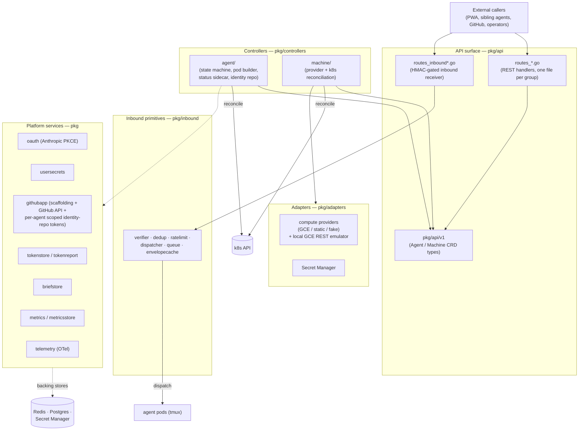
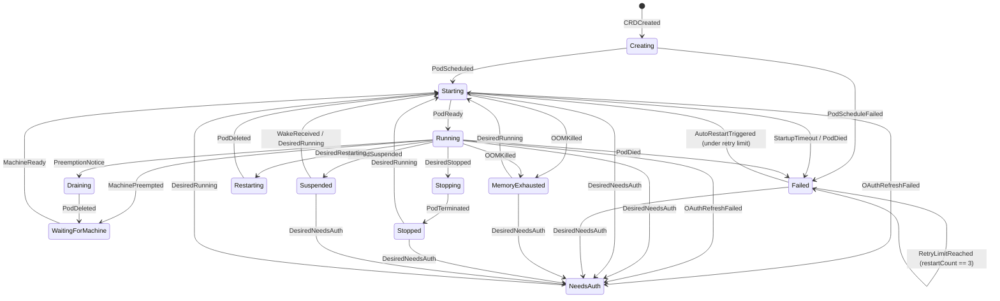
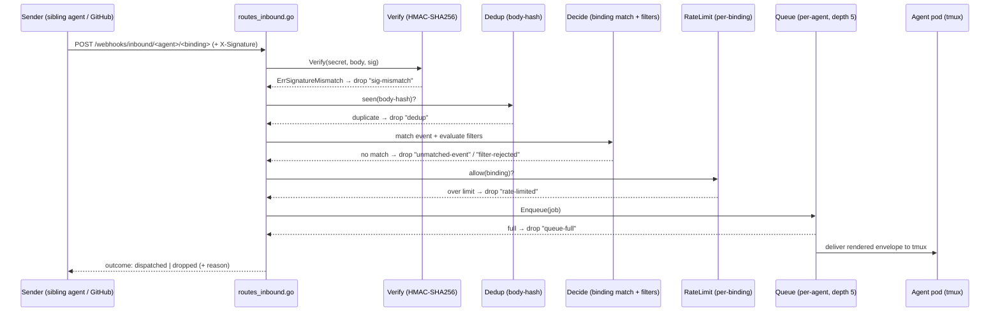

# Kyber Architecture — Overview

This is the whole-platform picture for kyber's `docs/architecture/` directory:
it routes you into the focused subsystem docs for detail and deliberately does
**not** re-document what those focused docs already cover — where a subsystem
has its own doc, this page links to it rather than restating it. For this doc
set's scope (HOW-not-WHAT), ownership, and the full page index, see
[`README.md`](README.md).

Kyber relates to two sibling repos: the private deploy repo (ArgoCD
Applications + per-environment values) and the optional Holocron hub (a
multi-install PWA host). This doc answers "how is kyber itself built."

> **HOW vs WHAT.** This `docs/architecture/` set is the **HOW** (mechanism). Its
> matched pair is [`docs/product/`](../product/README.md) — the **WHAT**:
> observable product behavior and concepts, no implementation detail. When a
> state or concept is named in both, this set owns the authoritative names and
> the product set links here.

---

## 1. Role in the stack

Kyber is the **self-hosted agent-fleet management platform** — the control
plane for running AI agents on cost-optimized cloud infrastructure. It runs on
Kubernetes (k3s for small installs, GKE/GCE for large), is deployed via
Terraform + Helm, and is CRD-driven: operators declare intent (an `Agent`, a
`Machine`) and controllers reconcile reality toward it. Each agent is a
long-lived pod with a full persistent filesystem, a session, an identity, and a
model. Kyber is the platform that creates those pods, keeps them alive across
preemption and restart, gates inbound prompts to them, and reports their state.

---

## 2. The three runtime components

Kyber ships as three runtime components. (The README names them for a first-time
reader; here we add the internal module view in the sections below.)

| Component | Form | Responsibility |
|---|---|---|
| **Control Plane** | modular-monolith Go binary (`cmd/control-plane`) | REST API, agent + machine lifecycle, telemetry, background workers, inbound dispatch |
| **Node Agent** | DaemonSet, one pod per k8s node (`cmd/node-agent`) | machine-level concerns only: node metrics → OpenTelemetry, machine actions (reboot/stop) on control-plane instruction |
| **Agent Runtime** | one pod per `Agent` CRD (`images/`) | the running agent: an entrypoint prepares a durable root filesystem on the agent's own volume and chroots the runtime (Claude Code in V1) into it, so the agent survives pod recreation and restarts with full filesystem continuity |

The Control Plane is the brain and the only component this overview decomposes
further (§ 4). The Node Agent is intentionally thin. The Agent Runtime's
durable root (`/persist/agentroot`, seeded from the base image and merged
forward on upgrade) and pod requirements (user namespaces, `CAP_SYS_ADMIN`) are
documented in
[`docs/installation.md`](../installation.md) and, for what they mean for the
cluster you run them on, the [deployment threat
model](../../.github/SECURITY.md#deployment-threat-model).

---

## 3. CRDs as the source of truth

Two custom resource definitions in the `kyber.io/v1` API group are the source of
truth for platform state. Operators (humans, the PWA, or other agents) declare
intent on the spec; controllers reconcile.

- **`Agent`** — a single AI agent instance: target machine, runtime type,
  compute resources, scaling mode, identity, secrets, model, and
  `spec.desiredPhase`.
- **`Machine`** — a cloud VM the platform manages: provider, machine type, disk
  size, spot pricing, zone.

The Go types live in [`pkg/api/v1/`](../../pkg/api/v1/) (group/version declared
in `pkg/api/v1/groupversion_info.go` as `{Group: "kyber.io", Version: "v1"}`).
The generated CRD manifests that ship in the chart live in
[`deploy/helm/kyber/crds/`](../../deploy/helm/kyber/crds/). Regenerate manifests
from the Go types with `make generate` — never hand-edit the generated CRDs.

---

## 4. Control-plane module map

The control plane is a modular monolith: one binary, internally decomposed
under `pkg/` by concern. The reconcilers talk to the k8s API (CRDs are the
state), to Redis (async/real-time events), and to Postgres (fleet metadata).

A subsystem-by-subsystem index of `pkg/` lives in
[`AGENTS.md`](../../AGENTS.md), the maintained repository map. Read the focused
docs (§ 8) before touching a subsystem that has one.

### API authorization

The REST surface sits behind a Bearer **API-key wall** (`pkg/api/auth.go`):
`authMiddleware` authenticates every request against the shared key and returns
401 on failure. On top of that authentication, agent **lifecycle** mutations
(`start`/`stop`/`restart`/`suspend`/`force-needs-auth`, all funnelling through
`setAgentDesiredPhase`) carry a **caller-level authorization** gate (kyber#474):
a caller resolves to a scope set and each verb requires a scope (`lifecycle:write`
for the fail-safe verbs, the strictly-higher `lifecycle:admin` for the impactful
ones). The legacy single key is full-scope and enforcement is off by default, so
this is backward-compatible. The full model — scope vocabulary, the
`Authenticator`→`Caller`→`authorizePhase` flow, the permissive-vs-enforce flag —
is in [`api-authorization.md`](api-authorization.md).

---

## 5. Agent / session lifecycle

An `Agent` CR moves through a **pure-function state machine**
([`pkg/controllers/agent/state_machine.go`](../../pkg/controllers/agent/state_machine.go))
driven by events the reconciler observes. The state machine itself has zero k8s
dependencies and is fully unit-testable in isolation; the reconciler
([`reconciler.go`](../../pkg/controllers/agent/reconciler.go)) is what watches
pods and feeds events in. Deletion is handled out-of-band in the reconciler
(`DeletionTimestamp`-driven), not through the state machine.

The diagram above is a summary. The **authoritative** lifecycle reference —
the full phase list, the event/action vocabulary, and the complete phase ×
event → (next phase, action) transition table — is the deep-dive:
[`agent-lifecycle.md`](agent-lifecycle.md). Phase names and exact transition
guards are authoritative in `state_machine.go`. Two notes that matter when
extending it:

- **OOM is its own phase.** A kernel-OOM-killed container routes to
  `MemoryExhausted` (operator bumps `spec.resources.memory` before retry) rather
  than `Failed`-with-auto-restart, so a too-small agent doesn't crash-loop.
- **Suspension is how preemption and idle wake are unified.** A spot-preemption
  notice and a "no work right now" both park the agent in `Suspended`; an
  operator start (`DesiredRunning`, via `POST …/start` or the console) brings it
  back to `Running`. A `WakeReceived` event exists in the state machine for
  message-triggered wake, but no production path emits it today — an inbound
  message does not wake a suspended agent (see
  [`agent-lifecycle.md`](agent-lifecycle.md) § 4).

How the running agent reports `status.activity` back up — the in-pod signal
source → status sidecar → control plane path — is the **status pipeline**, and
it has its own doc: [`status-pipeline.md`](status-pipeline.md). Do not have a
runtime POST directly to the control plane; go through the sidecar's localhost
forwarder as that doc describes.

An agent with an **identity repo** (its private GitHub repo of memory/persona/
state) authenticates git for that one repo with a short-lived, repo-scoped token
minted on demand by the install's Kyber Platform GitHub App via the internal API
(`GET /internal/agents/{name}/identity-repo-token`, pod-token-gated,
same-agent-only) — **no PAT fallback**, so a broken App flow fails loudly. The
full boot-time credential-helper flow is an invariant in
[`agent-lifecycle.md`](agent-lifecycle.md) § 7; the pod-token boundary it rides
is [`internal-api-auth.md`](internal-api-auth.md); the operator/product view is
[`../agents-identity-repos.md`](../agents-identity-repos.md).

---

## 6. Inbound webhook dispatch path

The inbound-prompts feature is the wire the Falcon Dev Team rides: an external
sender (a sibling agent, GitHub, a direct caller) POSTs a signed envelope to the control
plane, and — if it survives a fixed gauntlet of checks — it is delivered as a
prompt into the target agent's tmux session.

The primitives in [`pkg/inbound/`](../../pkg/inbound/) are pure logic (no HTTP,
k8s, or subprocess I/O); the API layer
([`routes_inbound*.go`](../../pkg/api/routes_inbound.go)) wires them to the
server and records the outcome on `Agent.status.inboundRuns[]`.

The drop reasons (`sig-mismatch`, `missing-secret`, `dedup`,
`unmatched-event`, `filter-rejected`, `rate-limited`, `queue-full`) and the two
outcomes (`dispatched`, `dropped`) are recorded on the `Agent` CR for operator
visibility. Key trust-boundary facts, stated so future changes don't weaken
them:

- **HMAC verification is the untrusted-input boundary.** `verifier.go` does a
  constant-time compare and collapses every failure mode to a single
  `ErrSignatureMismatch` — callers must treat it as a hard auth failure and must
  not differentiate causes externally.
- **The per-agent queue is bounded** (`QueueDepth = 5`); a flooded agent sheds
  load with `queue-full` rather than unbounded buffering.

Operator-facing inbound surfaces (`/api/v1/inbound-debug`, replay, status,
binding rotation) live alongside the receiver in `pkg/api/routes_inbound_*.go`.

---

## 7. Build & release model

Kyber tracks **semver `:vX.Y.Z`**. A release is cut by
`.github/workflows/prepare-release.yml` (operator or release-automation dispatch with a
`version` input, kyber#591): it folds the `Chart.yaml` `version`/`appVersion`
bump (kyber#457) **into the commit that gets tagged**, then pushes the tag
`vX.Y.Z` on that merged commit. The tag push triggers
`.github/workflows/release.yml`, which does a full rebuild of all five kyber
images from source at the tagged commit, pushes them as `:vX.Y.Z`, **refreshes
the control-plane `:latest` tag to the release image** (guarded — only while the
release commit is still `main` HEAD; kyber#591), cuts a GitHub Release, and opens
digest-pinned image-bump PRs on
[matty-v/kyber-deploy](https://github.com/matty-v/kyber-deploy) for every
production cluster — **kyber-falcon and kyber-gcp** — via a parallel
`[falcon, gcp]` matrix job (kyber#449). Each kyber-deploy bump PR is auto-merged
and ArgoCD on the release-track clusters syncs the pinned digests. Day-to-day,
canary clusters track `:latest` off `main` via ArgoCD Image Updater. razer is
correctly excluded from the per-env digest pins — it tracks `:latest` via ArgoCD
Image Updater and is never value-pinned per release; the release-time `:latest`
refresh is what gives it the clean release label immediately.

Each cluster-promotion leg emits a `cluster-promoted` or
`cluster-promote-failed` status signal to the release-notification webhook, so
the operator sees per-cluster progress in chat without inspecting CI. `fail-fast: false` on the matrix
keeps each leg isolated — a gcp failure does not strand falcon.

The split is deliberate: **image identity is pinned per-environment** (the
kyber-deploy bump writes `tag@digest` into each env's `values.yaml`), but the
**chart — including `Chart.yaml` — renders from `kyber@main` uniformly for all
clusters** (every ArgoCD app sets `targetRevision: main`).

**The user-facing version is build-injected, not chart-rendered (kyber#482).**
The version each cluster reports via `GET /api/v1/version` (the `chartVersion`
field) is **baked into the control-plane image at build time** via
`-ldflags "-X main.Version=…"` — exactly the mechanism that already populates
`sha`/`buildDate`. On the release path (`release.yml`) it is the release tag
with its leading `v` stripped; on the `:latest` canary path (`build.yml`) it is
`git describe --tags`. Because the chart bump is folded into the tagged commit
(kyber#591), a build **at a release commit** describes to the clean bare tag
(e.g. `2.2.0`); for genuine dev commits past the release it is
`2.2.0-3-gabc1234`, razer's honest offset ahead of the last release. Because the
version and `sha` are injected from the **same build in the same image**, they
converge atomically on image rollout and can never disagree — there is no steady
state where the code is live but the version string trails. `resolveDisplayVersion`
(`cmd/control-plane/version.go`) falls back to the chart-rendered
`/etc/kyber/chart-version` file only on local/dev builds where no ldflag was
passed.

razer picks up the clean release label without waiting for its next dev build
because `release.yml` refreshes `:latest` to the release image at tag time. Before
kyber#591 the canary could sit indefinitely on a stale **pre-tag** describe (e.g.
`2.1.1-7-gd64fbbd` after v2.2.0): the `:latest` build that happened to be running
predated the tag, and the post-tag chart bump was an image-less commit that never
triggered a canary rebuild.

The earlier chart-render derivation lagged by exactly one release: the image
deploy (the ArgoCD sync trigger) always beat the ~15-min-gated chart-version bump
merge to `main`, so each cluster re-rendered the chart version that was on `main`
one release ago. The `Chart.yaml` advance is **retained for Helm/ArgoCD operator
metadata** (`helm list`, the ArgoCD UI) and no longer feeds the user-facing
version — but since kyber#591 it happens **before** the tag (in
`prepare-release.yml`, folded into the tagged commit) rather than in a separate
post-tag PR. Cutting the tag on the bumped commit is also what makes the canary's
`git describe` resolve to the clean tag. The chart-version bump still lands on
`main`, not per-env — it remains a chart-level signal, just not the source of the
displayed version.

There is **no `:stable` tag and no `promote-stable` branch/workflow** — that
framing is retired. The kyber-side mechanics are in the
[release runbook](../operator/release-runbook.md). The deploy-repo internals
(ArgoCD Applications, per-env values) are kyber-deploy's deep-dive, not this one.

---

## 8. Where to go next

This overview is the index. For subsystem detail, follow these:

| Doc | Covers |
|---|---|
| [`README.md`](README.md) | this set's scope (HOW-not-WHAT), ownership, and the full page index |
| [`agent-lifecycle.md`](agent-lifecycle.md) | the agent state machine: phases, events, actions, full transition table, invariants (the authoritative § 5 reference) |
| [`status-pipeline.md`](status-pipeline.md) | in-pod signal source → status sidecar → `Agent.status.activity` |
| [`telegram-sidecar.md`](telegram-sidecar.md) | Telegram sidecar inbound/outbound flow, state bounds, and runtime guidance |
| [`metrics-data-flow.md`](metrics-data-flow.md) | metrics emission and aggregation flow |
| [`metricsstore.md`](metricsstore.md) | the metrics store backing model |
| [`pwa-views-publish-boundary.md`](pwa-views-publish-boundary.md) | PWA views publish boundary |
| [`log-retention.md`](log-retention.md) | durable off-cluster agent log retention: Vector shipper → GCS → `source=archive` read path |
| [`../adr/`](../adr/) | architecture decision records (memory system, file anatomy index) |
| [`../../AGENTS.md`](../../AGENTS.md) | orientation + the patterns/gotchas every agent should read before touching a subsystem |
